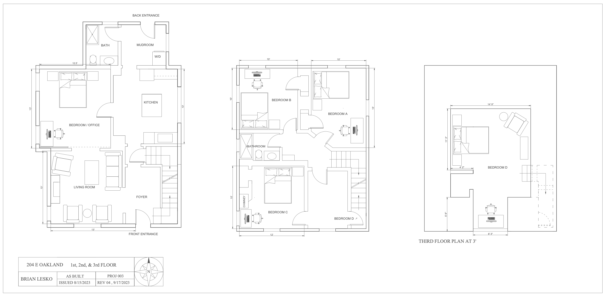

[](https://autocad-eoak-lesko.streamlit.app)
# My Rental Property
Web hosted demos and blog posts. Read about [My Crazy Rental Property as a College Student](https://autocad-eoak-lesko.streamlit.app) on my floorplan app

## Projects
### AutoCAD Floorplans
8/15/23 - Posted plan views of each floor in 204 E Oakland. Using AutoCAD, the drawings were made with architectural line styles and engineering standards.

### Floorplan viewer app and Rental property blog 
9/30/23
A [Streamlit](https://streamlit.io/) demo written in [Pure Python](https://github.com/BrianLesko/204_E_OAKLAND/blob/main/streamlit_app/floorplan_app.py) hosted on [Github](https://github.com/BrianLesko) for displaying the floorplan drawings of my rental house - created in [AutoCAD](https://www.autodesk.com). 


## Run this demo locally
```
pip install --upgrade streamlit
streamlit run https://github.com/BrianLesko/Robotics/blob/main/demo-FWRD-DYNM-2R/FWRD-DYNM-2R.py
```

## Topics 
Python | Streamlit | PIL | Github | AutoCAD 
session states | expander | columns | buttons | images | markdown
Architecture | Design | Drawing | Floorplan | House | Rental 
Rental Property | Real Estate | Investment Property | Investment
Robotics Engineer | Mechanica | Mechanical Engineering | Software engineer
